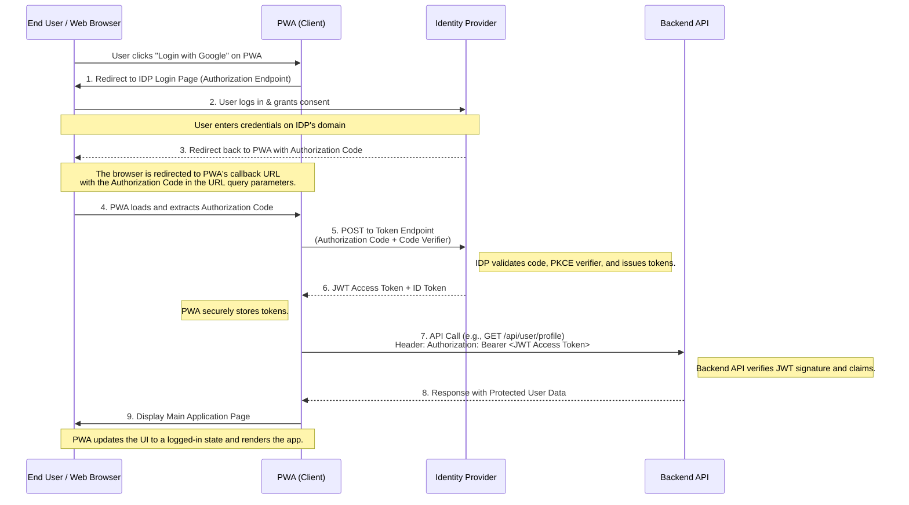

#OAuth Design

```mermaid
sequenceDiagram
    participant User as End User / Web Browser
    participant PWA as PWA (Client)
    participant IDP as Identity Provider
    participant API as Backend API

    User->>PWA: User clicks "Login with Google" on PWA
    PWA->>User: 1. Redirect to IDP Login Page (Authorization Endpoint)
    User->>IDP: 2. User logs in & grants consent
    Note over User,IDP: User enters credentials on IDP's domain
    IDP-->>User: 3. Redirect back to PWA with Authorization Code
    Note over User,PWA: The browser is redirected to PWA's callback URL<br>with the Authorization Code in the URL query parameters.

    User->>PWA: 4. PWA loads and extracts Authorization Code
    PWA->>IDP: 5. POST to Token Endpoint <br>(Authorization Code + Code Verifier)
    Note right of IDP: IDP validates code, PKCE verifier, and issues tokens.

    IDP-->>PWA: 6. JWT Access Token + ID Token
    Note left of PWA: PWA securely stores tokens.

    PWA->>API: 7. API Call (e.g., GET /api/user/profile)<br>Header: Authorization: Bearer <JWT Access Token>
    Note right of API: Backend API verifies JWT signature and claims.

    API-->>PWA: 8. Response with Protected User Data
    PWA->>User: 9. Display Main Application Page
    Note over PWA,User: PWA updates the UI to a logged-in state and renders the app.
```
