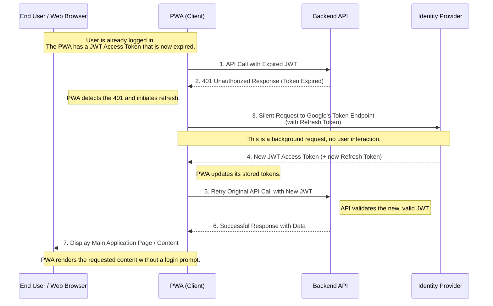

# OAuth using refresh token

```mermaid
sequenceDiagram
    participant User as End User / Web Browser
    participant PWA as PWA (Client)
    participant API as Backend API
    participant Google as Identity Provider

    Note over User,PWA: User is already logged in.<br>The PWA has a JWT Access Token that is now expired.
    PWA->>API: 1. API Call with Expired JWT
    API-->>PWA: 2. 401 Unauthorized Response (Token Expired)

    Note left of PWA: PWA detects the 401 and initiates refresh.
    PWA->>Google: 3. Silent Request to Google's Token Endpoint<br>(with Refresh Token)
    Note over PWA,Google: This is a background request, no user interaction.

    Google-->>PWA: 4. New JWT Access Token (+ new Refresh Token)
    Note right of PWA: PWA updates its stored tokens.

    PWA->>API: 5. Retry Original API Call with New JWT
    Note right of API: API validates the new, valid JWT.
    API-->>PWA: 6. Successful Response with Data
    PWA->>User: 7. Display Main Application Page / Content
    Note over PWA,User: PWA renders the requested content without a login prompt.
```
